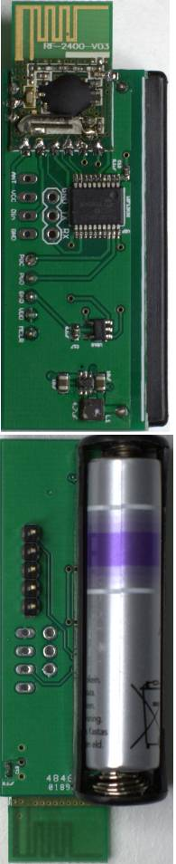

wirelesstemp
============

wirelesstemp is a wireless temperature sensor with following components:

- Microchip 18f13k22 microcontroller
- Microchip TC77 Thermal sensor with SPI interface
- RF-2400-V03 RF transmitter
- TPS61221 low input voltage boost converter
- 1.5 AAA battery

This 1.5V AAA battery operated temperature sensor sends measurement once each 65.5 seconds.
Sensor should operate for more than one year based on following measurements/assumptions:

- AAA battery holds 1000mAh.
- Sleep state consumes 90uA/65.5s
- Active state 40mA/15ms.

